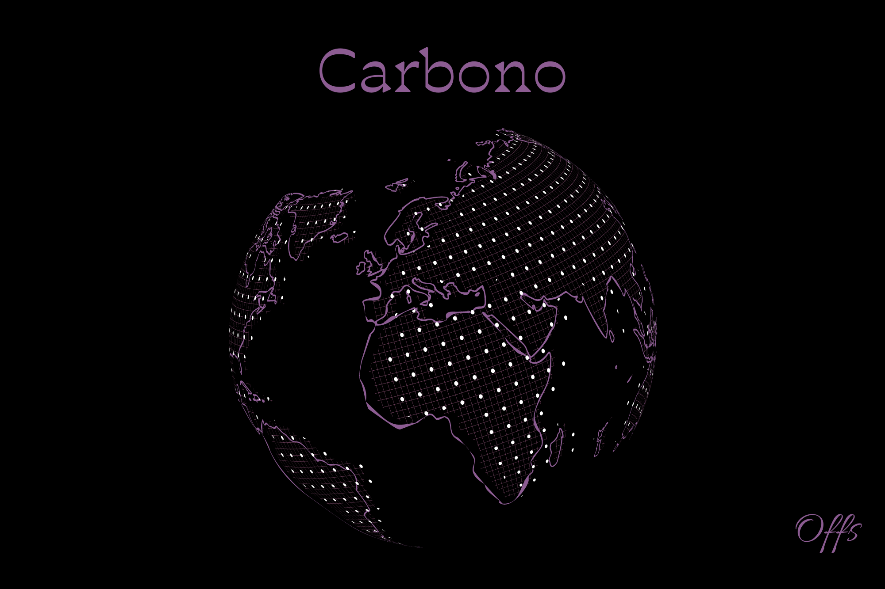

# Introducción



Herramienta para la automatización de despliegue de entornos para realizar retos de **pentesting**.

Cuenta con centenares de retos de ciberseguridad, tanto de carácter individual, como otros asociados a cursos de la plataforma [offs.es](https://offs.es)

> Todas los entornos de prueba serán desplegados en el entorno local del usuario, por lo que es perfecta para llevar a cabo pruebas de pentración offline y mejorar las **skills** de un usuario en **ciberseguridad**


# Instalación

Para la intalación de esta herramienta debemos ejecutar el fichero de **setup**.

```bash
sudo ./setup.sh
```

1. Actualiza los paquetes del sistemas para asegurarnos de tener las últimas versiones de las herramientas.
2. Instala python3 y pip3.
3. Instala docker y docker-compose.
4. Configura docker.
5. Instala las librerías de pip necesarias por la herramienta (customtkinter, pillow y requests).

# Configuración de entorno

Esta herramienta permite la descarga de archivos con retos y writeups. Por defecto, se descargarán en una carpeta llamada `offensiveSkills`, que se creará en el directorio **home (./~)** del usuario. Si deseamos que se esta carpeta se cree en otro repositorio debemos de especificarlo usando una variable global llamada **OFFS_PATH**

```bash
export OFFS_PATH="~/Desktop/"
echo 'export OFFS_PATH="~/Desktop/"' >  ~/.bashrc
```

O en el caso de que usemos otro tipo de shell como zsh(kali linux):

```bash
export OFFS_PATH="~/Desktop/"
echo 'export OFFS_PATH="~/Desktop/"' >  ~/.zshrc
```

# Uso de la herramienta

Para iniciar la herramienta debemos ejecutar un comando como el siguiente:

```bash
source venv/bin/activate
python3 app.py --username username --api-token api_token
```

Donde:
- `username`: Debe ser nuestro nombre de usuario.
- `api_token`: Token asociado al usuario.

Si no tenemos un token o no estamos registrados debemos de hacerlo en [offs.es](https://offs.es).


Para salir del entorno de virtual de python **(venv)** ejectar:

```bash
deactivate
```

---
# License 
Carbono © 2024 by Offensive Skills is licensed under Creative Commons Attribution-NonCommercial-ShareAlike 4.0 International

You can read more about the License in the [`LICENSE` documentation](./LICENSE.md)
